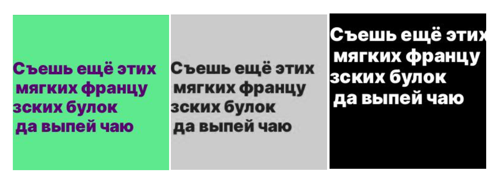

<h1 align="center">My cyrillic font</h1>

## Description
Это учебный проект, который создавался с целью демонстрации полученных навыков. 
Сервис рассчитан на распознавание 10 шрифтов кириллицы на изображениях, так что пользователь сможет найти нужный или похожий шрифт с бесплатной лицензией. 

## About project
Были сгенерированы изображения с учетом контраста фона и текста, который высчитывался по формуле цветового отличия стандарта cie76.

Для лучшего обучения моделей на изображения были добавлены панграммы - короткие тексты со всеми буквами алфавита. 

Были обучены три нейронные сети с архитектурами: LeNet5, ResNet18 и GoogleNet. Jupyter-ноутбуки с процессом обучения находятся в папках notebooks/models_*.

Лучшие результаты показала модель GoogleNet, поэтому она используется в итоговом варианте сервиса. Модель находится в папке models/

## Technologies

## Scheme

